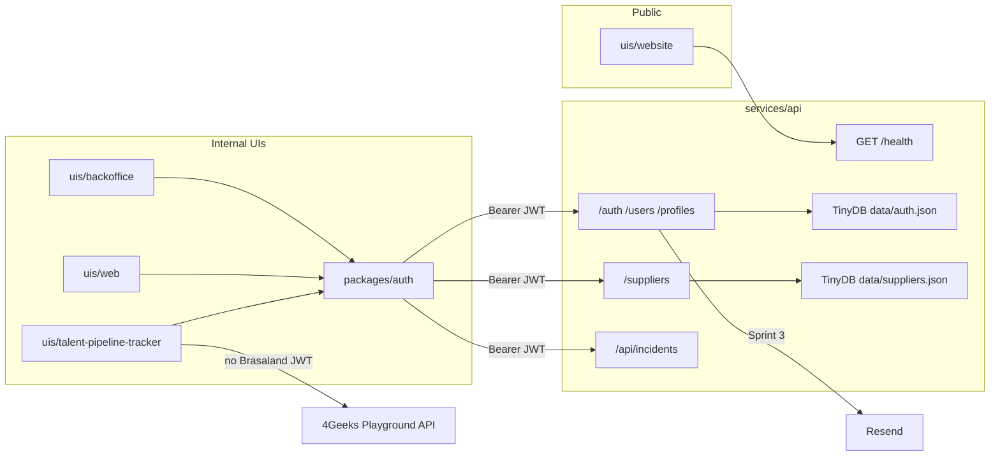

# Brasaland Identity Platform — Master Plan

One overall project: **secure Brasaland’s internal platform with JWT sessions, wire every internal UI to that contract, then add password recovery.**

Work stays in this monorepo fork. Do not create a new repository. Do not start FastAPI or Next.js auth code until a later session follows this document sprint by sprint.

**Branch:** `feature/brasaland-auth` (one branch, three sprint checklists).

**Teacher follow-up:** the original syllabi still say one pull request per project. This plan uses one branch plus three sprint checklists. Split PRs later if the instructor requires it.

---

## Sources

| Sprint | Ticket | Syllabus |
| --- | --- | --- |
| 1 | AUTH-01 | [User Authentication API](https://github.com/4GeeksAcademy/ai-engineering-syllabus/blob/main/content/projects/ai-eng-user-authentication-api/README.md) |
| 2 | AUTH-02 | [Authentication Flows in the Frontend](https://github.com/4GeeksAcademy/ai-engineering-syllabus/blob/main/content/projects/ai-eng-user-authentication-flows/README.md) |
| 3 | AUTH-03 | [Password Reset Flow](https://github.com/4GeeksAcademy/ai-engineering-syllabus/blob/main/content/projects/ai-eng-user-authentication-restore/README.md) |

Do not start a later sprint until the earlier checklist is complete. Sprint 2 restores UIs that Sprint 1 deliberately breaks with `401`. Sprint 3 needs login, `/auth/me`, and a stored JWT.

---

## Locked decisions

1. **Talent Pipeline Tracker data** stays on the 4Geeks Playground API (`uis/talent-pipeline-tracker/lib/api.ts` + `NEXT_PUBLIC_API_URL`). Brasaland auth covers login, guards, and profile only. Do not send Brasaland JWTs on playground candidate calls. Do not move candidate CRUD onto `services/api`.
2. **Shared auth** lives under `packages/` as `@repo/auth`. Internal apps import it. Do not copy login, register, or account implementations three times.
3. **Delivery** is one branch with Sprint 1 / 2 / 3 checklists in this file (not three separate PRs unless the instructor later requires them).
4. **Sprint 3 email** uses **Resend**.
5. **Seeded demo admin:** Lucía Fernández (Procurement Manager) as `admin`, so Lucía’s supplier directory and incident analysis can be opened without registering first.

---

## Current baseline (do not regress)

- Canonical API: `services/api/main.py` (not `services/api/app/main.py`). Today it serves suppliers + incidents and `GET /health`.
- Supplier TinyDB: `services/api/data/suppliers.json` via `services/api/database.py`.
- Public site: `uis/website` (Milestone 1), including `/brasa-points`. Stays fully public. Brasa Points is **not** this User/Profile system.
- Internal UIs:
  - `uis/backoffice` port **3101** — operations overview + `/suppliers` (`lib/suppliersApi.ts` → Brasaland API).
  - `uis/web` port **3102** — incident CSV analysis (`src/lib/api.ts` → Brasaland API).
  - `uis/talent-pipeline-tracker` port **3000** — candidates on the Playground API.
- CORS in `services/api/main.py` already allows `localhost`/`127.0.0.1` on `3000`, `3101`, and `3102`.
- Root `package.json` has **no npm workspaces** and must not be changed for this project (protected root workspace config). Consume `@repo/auth` with `file:` dependencies in each internal UI.

---

## Architecture

```text
uis/website/                    public — no auth, including /brasa-points
uis/backoffice/                 thin /login /register /account routes + guard
uis/web/                        same thin routes + guard
uis/talent-pipeline-tracker/    same thin routes + guard; candidates stay on Playground
packages/auth/                  @repo/auth — token, authFetch, forms, client guard

services/api/main.py            canonical FastAPI app
  app/auth/                     JWT, get_current_user, password hashing
  app/users/                    TinyDB User CRUD + /users
  app/profiles/                 TinyDB Profile + /profiles
  data/auth.json                users + profiles (not suppliers.json)
  data/suppliers.json           existing supplier directory
  routes/suppliers.py           protect with get_current_user
  app/routers/incidents.py      protect analyze + export
```



**TinyDB split:** User and Profile stay in TinyDB only (`data/auth.json`, tables `users` and `profiles`), now and after Supabase is added. Do not create user or profile tables in PostgreSQL. Inventory and other SQL tables may store only the TinyDB user `id` as `user_uuid`.

**Keep public:** `GET /health` and all of `uis/website`.

**Protect in Sprint 1** (need at least five existing routes outside `/users` and `/auth`; lock all of these):

- `GET /suppliers` and `POST /suppliers`
- `GET /suppliers/{id}`
- `PATCH /suppliers/{id}/rate`
- `PATCH /suppliers/{id}/status`
- `DELETE /suppliers/{id}`
- `POST /suppliers/admin/seed`
- `POST /api/incidents/analyze`
- `GET /api/incidents/results/export`

**Shared package (`@repo/auth`):** same naming pattern as `packages/shared` (`@repo/shared-types`). Each internal UI (`uis/backoffice`, `uis/web`, `uis/talent-pipeline-tracker`) adds `"@repo/auth": "file:../../packages/auth"` and Next `transpilePackages: ["@repo/auth"]`.

The package owns:

- Token get / set / clear (`localStorage`)
- `authFetch` to the Brasaland API (`Authorization: Bearer`)
- Login, register, profile, and (Sprint 3) forgot / reset / change-password UI
- Client guard hook or layout helper

Each internal app only mounts **thin** App Router pages that import those components. Next.js cannot share `app/` file-system routes across apps; thin `page.tsx` files are required and are **not** three separate implementations.

**Apps in scope for `@repo/auth`:** `uis/backoffice`, `uis/web`, `uis/talent-pipeline-tracker`.  
**Out of scope:** `uis/website`.

---

## Environment variables (names only — never commit secrets)

Document these in `services/api/.env.example` and UI `.env.example` files as they are introduced. Real values stay in gitignored `.env` / `.env.local`. Do not commit `KT_PUBLIC_API_KEY` or any other key.

| Variable | Where | When |
| --- | --- | --- |
| `SECRET_KEY` | API | Sprint 1 — JWT signing secret |
| `ACCESS_TOKEN_EXPIRE_MINUTES` | API | Sprint 1 |
| `SEED_ADMIN_EMAIL` | API | Sprint 1 |
| `SEED_ADMIN_PASSWORD` | API | Sprint 1 |
| `NEXT_PUBLIC_API_BASE_URL` | backoffice, web, talent tracker (auth only) | existing / Sprint 2 — Brasaland API, default `http://localhost:8000` |
| `NEXT_PUBLIC_API_URL` | talent tracker | existing — Playground candidate API; do not reuse for Brasaland auth |
| `RESEND_API_KEY` | API | Sprint 3 |
| `RESET_TOKEN_EXPIRE_MINUTES` | API | Sprint 3 (15–60) |
| `PUBLIC_APP_URL` | API | Sprint 3 — origin used to build `/reset-password?token=...` links |

---

## Sprint 1 — AUTH-01: Lock the API

**Goal:** No sensitive Brasaland route is reachable without a valid session.

**Scope:** `services/api` only. Frontends will start returning `401` on suppliers and incidents; that is expected.

### Install

From `services/api`:

```bash
uv add "python-jose[cryptography]" "libpass[bcrypt]"
```

Never `pip install` for new deps. Passwords: `from passlib.hash import bcrypt` (libpass is the maintained drop-in). Never store or compare plaintext.

### User (TinyDB)

Fields: `id`, `email`, `hashed_password`, `is_active`, `role`, `created_at`.  
Do **not** store display name or contact fields on `User`.

`role` accepts only `admin`, `manager`, or `user` (Enum or field validator). `POST /users` defaults `role` to `user`.

Service layer: create user, get by ID, get by email, update user, delete user. Delete user also removes the linked profile.

### Profile (TinyDB, one-to-one via `user_id`)

Fields: `id`, `user_id`, `name`, `phone`, `address`.

### Endpoints

| Method | Path | Auth |
| --- | --- | --- |
| `POST` | `/users` | Public. Hash password. Optional `name`, `phone`, `address` create the linked Profile in the same operation. |
| `GET` | `/users` | Protected |
| `GET` | `/users/{id}` | Protected |
| `PUT` | `/users/{id}` | Protected; self or admin. Role change: admin only. |
| `DELETE` | `/users/{id}` | Protected. Also delete linked Profile. |
| `GET` | `/profiles/me` | Protected |
| `PUT` | `/profiles/me` | Protected; owner only |
| `POST` | `/auth/login` | Public. Body `{ email, password }` → signed JWT. Use `OAuth2PasswordBearer` for subsequent Bearer extraction. |
| `GET` | `/auth/me` | Protected. Return `email`, `role`, plus linked Profile (name and contact). |

JWT claims include the TinyDB user `id`. `SECRET_KEY` and `ACCESS_TOKEN_EXPIRE_MINUTES` from env — never hardcode. `get_current_user` extracts `Authorization: Bearer`, decodes, loads the user, raises `HTTPException(401)` on any failure.

**Status codes:** `401` unauthenticated (missing, expired, or malformed token). `403` when a user accesses or updates another user’s credentials or profile.

Stateless JWT only. No session cookies.

### Seed Lucía Fernández

Idempotent seed: run on startup if the auth DB has no users, plus a `uv run` helper.

- Name: Lucía Fernández (Profile)
- Role: `admin`
- Email / password: `SEED_ADMIN_EMAIL` / `SEED_ADMIN_PASSWORD` from env
- Hash the password before insert
- Create the linked Profile in the same seed

Document variable names in `services/api/.env.example`. Never commit the real password file.

### Sprint 1 checklist

- [ ] `User` model in TinyDB with `id`, `email`, `hashed_password`, `is_active`, `role`, `created_at` — no name/phone/address on User
- [ ] `role` accepts only `admin`, `manager`, `user`; `POST /users` defaults to `user`
- [ ] Service layer: create, get by id, get by email, update, delete
- [ ] `POST /users` hashes password; optional profile fields create Profile
- [ ] `GET /users`, `GET /users/{id}`, `PUT /users/{id}`, `DELETE /users/{id}` (protected; delete removes profile)
- [ ] `PUT /users/{id}`: self or admin; role change admin only
- [ ] `Profile` model linked 1:1 via `user_id` with `name`, `phone`, `address`
- [ ] `GET /profiles/me` and `PUT /profiles/me` (owner only)
- [ ] `POST /auth/login` returns a signed JWT
- [ ] `GET /auth/me` returns email, role, and Profile
- [ ] `get_current_user` dependency on protected routes
- [ ] Token expiry and signing secret from environment variables
- [ ] All listed supplier and incident routes require a valid token (`GET /health` stays public)
- [ ] `401` without/invalid token; `403` for another user’s credentials/profile
- [ ] Lucía admin seed is idempotent and hashed
- [ ] User and Profile remain in TinyDB only (`data/auth.json`)
- [ ] Auth routes under `/auth`, users under `/users`, profiles under `/profiles`

### Verify (manual, `http://localhost:8000/docs`)

1. `POST /users` → `POST /auth/login` → Authorize → `GET /auth/me`
2. Login as Lucía → `GET /suppliers` succeeds
3. Protected route with no token → `401`
4. Expired or malformed token → `401`
5. User A updates user B → `403`

### Sprint 1 done when

User CRUD works; each User has a Profile; roles validated; passwords hashed; JWT issued; `get_current_user` works; at least five existing routes (all listed above) require a token; prefixes are clean; TinyDB-only users/profiles; Lucía can authenticate in `/docs`.

**Expected breakage:** `uis/backoffice` suppliers and `uis/web` incident upload/export return `401` until Sprint 2.

---

## Sprint 2 — AUTH-02: Connect internal UIs

**Goal:** Internal Brasaland apps send the JWT and hide views from anonymous users. Public website unchanged.

Do not build a separate authentication app. Do not use Next.js middleware unless the token is also in a cookie the middleware can read. Use a **client** layout guard or hook that reads `localStorage`.

### Token lifecycle

1. Login / register: store token in `localStorage`
2. Protected Brasaland API calls: `Authorization: Bearer <token>` via `authFetch`
3. Logout: remove token, redirect to `/login`
4. Any protected Brasaland call returns `401`: clear token, redirect to `/login`

### Shared package work

Create `packages/auth` (`@repo/auth`) with README describing the public API. Forms and guard live here once.

Thin routes in **each** of `uis/backoffice`, `uis/web`, `uis/talent-pipeline-tracker`:

- `/login` — email + password; success → store token, redirect to that app’s main authenticated view; failure → clear error
- `/register` — `POST /users` (optional profile fields) then `POST /auth/login`; store token; field-level errors on failure
- `/account/profile` — `GET /auth/me` (email from User, name/phone/address from Profile); edit via `PUT /profiles/me`

### App matrix

| App | Auth |
| --- | --- |
| `uis/website` | None. No package import, no login, no redirect. `/` and `/brasa-points` stay public. |
| `uis/backoffice` | Guard `/` and `/suppliers`. Attach Bearer in `lib/suppliersApi.ts`. |
| `uis/web` | Guard `/` and `/incidents`. Bearer on analyze **and** export (export is a bare URL today; it must send the header, not only open the URL). |
| `uis/talent-pipeline-tracker` | Guard candidate views. Login/register/profile/logout against Brasaland. Leave `lib/api.ts` on the Playground API with **no** Brasaland JWT. Add `NEXT_PUBLIC_API_BASE_URL` (or equivalent) for Brasaland auth routes only. |

### Sprint 2 checklist

- [ ] `@repo/auth` package exists; no duplicated login/register/account implementations
- [ ] Each internal app depends on the package via `file:` and `transpilePackages`
- [ ] Thin `/login`, `/register`, `/account/profile` routes in backoffice, web, and talent tracker
- [ ] Client guard redirects to `/login` when the token is absent or invalid
- [ ] `uis/website` has no token check and no redirect
- [ ] Login and register store the token and redirect to the app’s authenticated home
- [ ] Profile shows User email + Profile contact; save via `PUT /profiles/me`
- [ ] Logout clears the token and redirects to `/login`
- [ ] `401` from a protected Brasaland call clears the session and redirects
- [ ] `uis/backoffice/lib/suppliersApi.ts` sends Bearer
- [ ] `uis/web/src/lib/api.ts` sends Bearer on analyze and export
- [ ] Talent tracker candidate `fetch` still uses Playground `NEXT_PUBLIC_API_URL` only
- [ ] Lucía can open `/suppliers` and incident analysis after login
- [ ] Protected monorepo routes still behave correctly with a valid token (no Sprint 1 regressions)

### Verify

- Register → token in `localStorage` → land on authenticated home
- Login as Lucía → backoffice `/suppliers` and web `/incidents` work
- Logout → token gone → `/login`
- Open `/suppliers` logged out → `/login`
- Website `/` and `/brasa-points` with no token
- Forced `401` clears session and redirects

### Sprint 2 done when

Login/register work end-to-end; internal views are guarded; website is untouched; profile read/update works; logout and `401` handling work; supplier and incident flows work **with** a token; talent candidates still hit Playground.

---

## Sprint 3 — AUTH-03: Password recovery and change

**Goal:** Recover access when forgotten; change password while logged in. Real email via **Resend**.

### Backend

| Method | Path | Behavior |
| --- | --- | --- |
| `POST` | `/auth/forgot-password` | `{ email }`. If the user exists: short-lived reset token (15–60 min), email a reset link. **Always HTTP 200** (no user enumeration). |
| `POST` | `/auth/reset-password` | `{ token, new_password }`. Validate signature, expiry, **and unused**. Hash, update user, invalidate token. `400` if invalid, expired, or already used. |
| `POST` | `/auth/change-password` | Bearer required. `{ current_password, new_password }`. `400` if current password is wrong. |

Reset tokens **must** have server-side invalidation (hashed token row, used-token record, or `password_changed_at`). JWT `exp` alone is not enough.

Email: Resend. Mobile-readable body with link `{PUBLIC_APP_URL}/reset-password?token=...`. `RESEND_API_KEY` only in env. Document the variable name in `services/api/README.md` or `.env.example`.

### Frontend (in `@repo/auth` + thin routes; not the public website)

- `/forgot-password` — always show “If that address is registered, you’ll receive a link shortly”; disable the form after submit
- `/reset-password` — token from query string; new password + confirmation; success → `/login`; failure → error + link to `/forgot-password`
- `/account/change-password` — current, new, confirm; match client-side before calling the API
- Login: “Forgot your password?” → `/forgot-password`

### Sprint 3 checklist

- [ ] `POST /auth/forgot-password` sends a real Resend email with the reset link for a registered address
- [ ] `POST /auth/forgot-password` returns `200` even when the address is not registered
- [ ] Reset token expires after the configured window
- [ ] `POST /auth/reset-password` updates the password and invalidates the token
- [ ] `POST /auth/reset-password` returns `400` for expired or already-used tokens
- [ ] `POST /auth/change-password` rejects wrong current passwords with `400`
- [ ] `/forgot-password` shows the generic confirmation and disables resubmit
- [ ] `/reset-password` reads `token` from the URL and redirects to `/login` on success
- [ ] `/reset-password` shows a clear error and a link back to `/forgot-password` on failure
- [ ] `/login` has a visible “Forgot your password?” link
- [ ] `/account/change-password` validates matching new password and confirmation
- [ ] No API keys in the codebase — env only (`RESEND_API_KEY`, JWT secret, seed password)

Optional (not evaluated): HTML email template, rate limiting, audit log.

### Verify

- Registered email → real message with link
- Unknown email → still `200`; UI still confirms
- Token works once; second use `400`
- Expired token `400`
- Wrong current password on change → `400`
- Full flow: forgot → email → reset → login with new password

### Sprint 3 done when

Forgot / reset / change work; tokens expire and are one-time; forgot-password does not leak accounts; login has the forgot link; change-password validates confirmation; secrets are env-only.

---

## Rubric map

The full grade sheet (every **What We Will Evaluate** item from the three syllabi, plus Brasaland locks) is [`Global_Criteria.md`](./Global_Criteria.md).

**Sprint 1:** User CRUD; Profile 1:1; role enum + default `user`; hashed passwords; JWT; `get_current_user`; `401` / `403`; env expiry/secret; `/auth` `/users` `/profiles`; ≥5 existing routes locked; TinyDB-only users; no regression with a valid token.

**Sprint 2:** login/register store token; guards; website public; profile via `/auth/me` and `PUT /profiles/me`; logout; `401` clears session; Playground candidate calls unchanged.

**Sprint 3:** real Resend reset email; forgot always 200; expiry; one-time token; reset UI; forgot link on login; change-password; no hardcoded keys.

---

## Delivery rule

One master project, one branch (`feature/brasaland-auth`), three sprint checklists in this file, in order.

- Do not implement Sprint 2 until Sprint 1’s checklist and `/docs` verification pass.
- Do not implement Sprint 3 until login and `/auth/me` work in the internal UIs.
- If the instructor later wants three PRs, split this branch without changing the product.

Out of scope for the whole Identity project: role-based permissions on every route (optional extra), merging Brasa Points with User/Profile, moving talent candidates off Playground, putting APIs inside Next.js route handlers, changing root npm workspaces.
